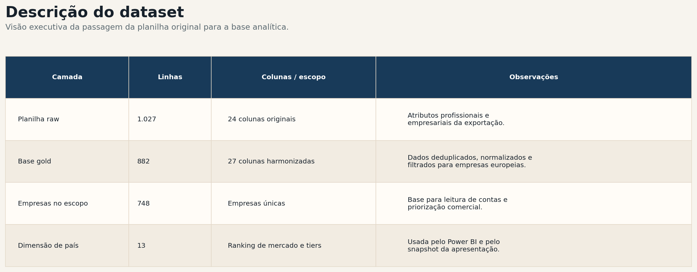
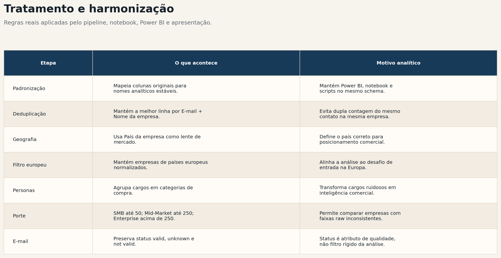
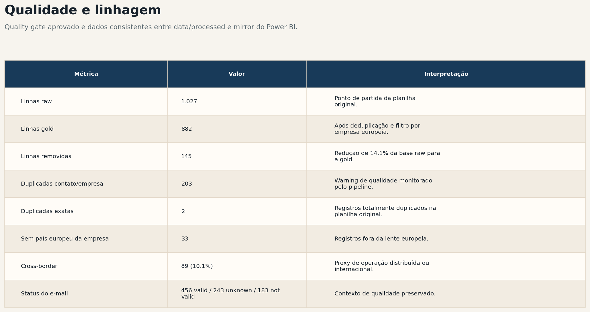
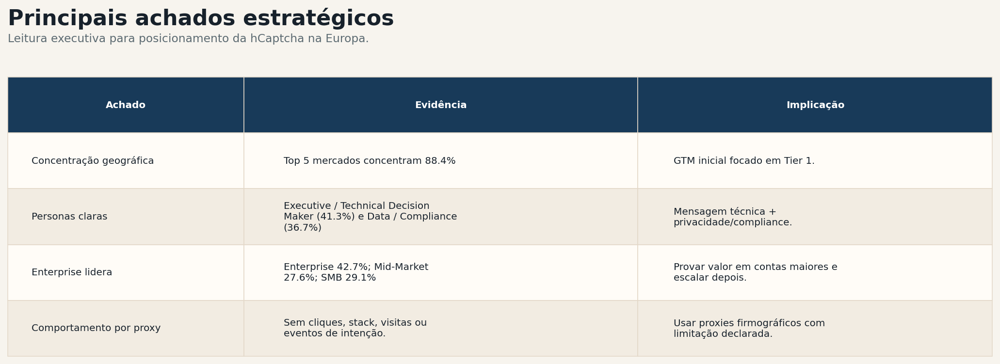
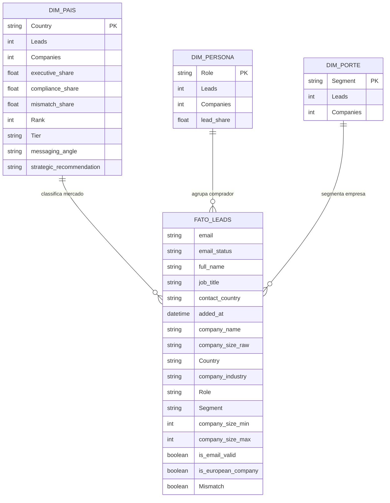
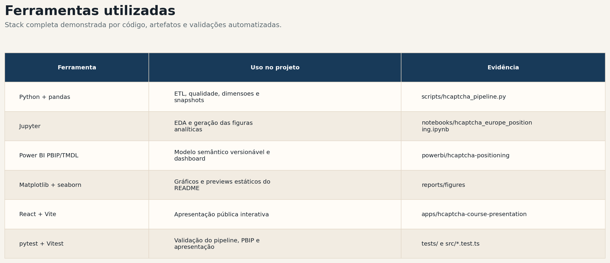

# isabellysto-prepara-portugal

## Visão Geral do Projeto

Este repositório contém um fluxo completo de analytics engineering para o desafio de posicionamento da hCaptcha na Europa. O projeto parte de uma exportação de leads da Snov.io e transforma a planilha original em um ativo reproduzível de inteligência de mercado, com pipeline testado, modelo Power BI versionável, relatório executivo, apresentação pública e documentação operacional.

A pergunta central do projeto é: **como a hCaptcha deve se posicionar no mercado europeu?**

## Relatório Analítico

O README foi estruturado para funcionar como uma entrega visível no GitHub: descreve a base raw, mostra o tratamento aplicado, documenta a qualidade dos dados, apresenta o modelo semântico e exibe prévias visuais do dashboard.

### Descrição do Dataset

A análise parte da planilha original do desafio, mantida localmente como [`Planilha - Desafio de Dados - Página1.csv`](Planilha%20-%20Desafio%20de%20Dados%20-%20P%C3%A1gina1.csv) e espelhada em `data/raw/` para garantir reprodutibilidade.



O arquivo raw contém campos pessoais e empresariais como e-mail, status do e-mail, nome do contato, cargo, país do contato, nome da empresa, porte da empresa, país da empresa, cidade da empresa, setor da empresa e classificação. A análise pública evita expor dados pessoais nos artefatos de apresentação; o Power BI e o site usam agregações, dimensões e snapshots sanitizados.

### Tratamento e Harmonização

O pipeline em [`scripts/hcaptcha_pipeline.py`](scripts/hcaptcha_pipeline.py) aplica as mesmas regras usadas pelo notebook, pelo modelo Power BI e pela apresentação pública.



### Qualidade e Linhagem

O último quality gate está aprovado e registra a linhagem atual da planilha raw até os outputs Gold. O espelho local usado pelo Power BI Desktop em `C:\Users\02luc\Documents\PowerBIData\hcaptcha\processed` contém os mesmos quatro CSVs processados de `data/processed/`, verificados por hash durante a auditoria.



### Principais Achados Estratégicos



## Modelo Semântico em Mermaid

O Mermaid abaixo representa o modelo analítico real usado pelo projeto Power BI. A tabela `Leads` funciona como fato principal, em granularidade de lead tratado, e se relaciona com dimensões de país, persona e porte.



## Dashboard e Visualizações

O GitHub não executa relatórios Power BI interativos dentro do README. Como este projeto usa Power BI Desktop gratuito, a entrega visual no GitHub é feita com prévias estáticas geradas a partir dos mesmos CSVs processados que alimentam o PBIP. O relatório interativo completo está versionado em [`powerbi/hcaptcha-positioning/hcaptcha_report.pbip`](powerbi/hcaptcha-positioning/hcaptcha_report.pbip).

### Prévia das Páginas do Power BI

#### Market Command


#### Buyer Intelligence


#### Border Signal


#### Action Map


### Figuras Analíticas do Notebook

As figuras abaixo são geradas pelo notebook e resumem os principais cortes usados no relatório executivo.

#### Prioridade de Mercado por País


#### Mix de Personas por Porte de Empresa


#### Sinal Cross-Border


## Ferramentas Utilizadas



## Estrutura do Repositório

- `scripts/`: pipeline ETL, geração de assets do README, geração do PBIP e automações operacionais
- `tests/`: cobertura pytest para transformações, Power BI e scripts operacionais
- `notebooks/`: análise exploratória e geração das figuras principais
- `powerbi/`: projeto Power BI versionável em formato `PBIP`/`TMDL`
- `apps/`: apresentação pública em React/Vite e assets de entrega
- `reports/`: relatório executivo, figuras, glossário, roteiro do apresentador e logs
- `docs/`: blueprints, notas do modelo semântico e runbooks operacionais
- `data/`: diretórios locais de dados raw e processados, ignorados no Git por desenho

## Como Executar

### 1. Preparar os dados locais

Coloque a planilha raw em `data/raw/inbox/` ou execute o pipeline diretamente apontando para um CSV local.

### 2. Instalar dependências Python

```bash
python -m pip install pandas pytest jupyter matplotlib seaborn plotly watchdog requests
```

### 3. Rodar o pipeline ETL

```bash
python scripts/hcaptcha_pipeline.py \
  --input "data/raw/inbox/Planilha - Desafio de Dados - Página1.csv" \
  --output-dir data/processed \
  --quality-dir reports/quality \
  --config config/pipeline_settings.json
```

### 4. Gerar as figuras e prévias do README

```bash
python scripts/build_readme_visual_assets.py
```

### 5. Abrir o projeto Power BI

Abra [`powerbi/hcaptcha-positioning/hcaptcha_report.pbip`](powerbi/hcaptcha-positioning/hcaptcha_report.pbip) no Power BI Desktop, verifique o parâmetro `DataRoot`, faça o refresh do modelo e salve uma cópia `.pbix` local se necessário.

### 6. Regenerar o snapshot e a apresentação

```bash
python scripts/build_presentation_snapshot.py
npm --prefix apps/hcaptcha-course-presentation run deck
```

Para rodar o site local da apresentação:

```bash
npm --prefix apps/hcaptcha-course-presentation run dev -- --port 5174
```

### 7. Usar o modo watcher

Execução única:

```bash
python scripts/watcher.py --once --config config/pipeline_settings.json
```

Monitoramento contínuo:

```bash
python scripts/watcher.py --config config/pipeline_settings.json
```

## Governança e Privacidade

Exportações reais de leads podem conter dados pessoais como nomes, e-mails, LinkedIn e empresas. Por isso:

- `data/raw/` e `data/processed/` são ignorados pelo Git;
- arquivos `.pbix` binários são ignorados;
- o repositório mantém o projeto Power BI em formato versionável `PBIP`;
- o site público usa snapshot sanitizado e agregações;
- credenciais e variáveis locais devem ficar fora do repositório.

## Artefatos de Entrega

- Power BI: [`powerbi/hcaptcha-positioning/hcaptcha_report.pbip`](powerbi/hcaptcha-positioning/hcaptcha_report.pbip)
- Relatório executivo: [`reports/hcaptcha_positioning_summary.md`](reports/hcaptcha_positioning_summary.md)
- Glossário técnico: [`reports/glossario_termos_tecnicos.pdf`](reports/glossario_termos_tecnicos.pdf)
- Roteiro do apresentador: [`reports/hcaptcha_roteiro_apresentador.pdf`](reports/hcaptcha_roteiro_apresentador.pdf)
- Apresentação pública: [`apps/hcaptcha-course-presentation`](apps/hcaptcha-course-presentation)
- Blueprint do dashboard: [`docs/powerbi/dashboard_blueprint.md`](docs/powerbi/dashboard_blueprint.md)
- Notas do modelo semântico: [`docs/modeling/semantic_model_notes.md`](docs/modeling/semantic_model_notes.md)

## Status Atual

O repositório contém:

- implementação original da análise de mercado hCaptcha Europa;
- pipeline ETL testado com quality gates;
- outputs Gold e dimensões para Power BI;
- projeto Power BI em `PBIP` com visuais nativos, medidas e filtros;
- relatório executivo e figuras analíticas;
- apresentação pública interativa com snapshot sanitizado;
- automações para watcher e exportação local dos dados processados.

## Observações

Este projeto não depende de assinatura Power BI Service. A exploração interativa é feita no Power BI Desktop gratuito a partir do arquivo `PBIP`; o GitHub exibe prévias estáticas para tornar o projeto compreensível sem abrir ferramentas externas.
