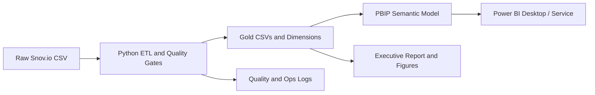

# isabellysto-prepara-portugal

## Project Overview

This repository contains a complete analytics engineering workflow for the hCaptcha Europe positioning challenge. The project starts from a lead export sourced from Snov.io and turns it into a reproducible market-intelligence asset with:

- a tested Python ETL pipeline
- a versionable Power BI Project (`PBIP`/`TMDL`)
- an executive report with GTM recommendations
- operational extensions for automated ingestion, quality controls, and Power BI Service deployment readiness

The core business question is: **how should hCaptcha position itself in the European market?**

## Architecture



## Repository Structure

- `scripts/`: ETL pipeline, Power BI project generation, and operational automation
- `tests/`: pytest coverage for transformation rules and operational scripts
- `notebooks/`: exploratory and delivery notebook assets
- `dashboards/`: PBIP project and dashboard blueprint
- `reports/`: executive report plus generated figures and ops logs
- `models/`: semantic-model notes
- `docs/`: design specs, plans, and deployment runbooks
- `data/`: local-only raw and processed data directories kept out of Git by design

## Governance and Privacy

Real lead exports are intentionally excluded from version control. Raw and processed datasets may contain personally identifiable information such as names, emails, and company details. For that reason:

- `data/raw/` and `data/processed/` are ignored by Git
- `.pbix` binaries are ignored; the repository keeps the text-based `PBIP` source instead
- local toolchains and secrets are not published

This repository is designed to be safe for public versioning while keeping the project reproducible.

## How to Run

### 1. Prepare your local data

Place the raw Snov.io export in `data/raw/inbox/` or run the pipeline directly against a local CSV path.

### 2. Install local dependencies

Example:

```bash
python -m pip install pandas pytest jupyter matplotlib seaborn plotly watchdog requests
```

Optional local tooling used during development:

- Power BI Desktop on Windows
- `pbi-tools`
- `.NET`

### 3. Run the ETL pipeline

```bash
python scripts/hcaptcha_pipeline.py \
  --input /path/to/export.csv \
  --output-dir data/processed \
  --quality-dir reports/quality
```

### 4. Open the Power BI Project

Open `dashboards/hcaptcha_report/hcaptcha_report.pbip` in Power BI Desktop, refresh the model, and save a local `.pbix` if needed.

## Power BI Service Readiness

The repository includes a deploy-ready path for Power BI Service:

- approved Gold outputs are mirrored to a fixed Windows folder for gateway use
- a deployment preflight validates required settings
- a refresh script can trigger a dataset refresh through the Power BI REST API

See:

- `docs/deploy_pbi_service.md`
- `docs/operational_runbook.md`

## Technical Stack

- Python 3
- pandas
- pytest
- Jupyter
- Power BI PBIP / TMDL
- Power BI REST API

## Current Status

The repository currently contains:

- the original hCaptcha market analysis implementation
- the PBIP project used to materialize the dashboard in Power BI Desktop
- operational design scaffolding for automated ingestion, quality gates, and Service refresh

## Notes

If you clone this repository, keep your own local data files under `data/` and your own credentials in environment variables or local `.env` files that are not committed.
