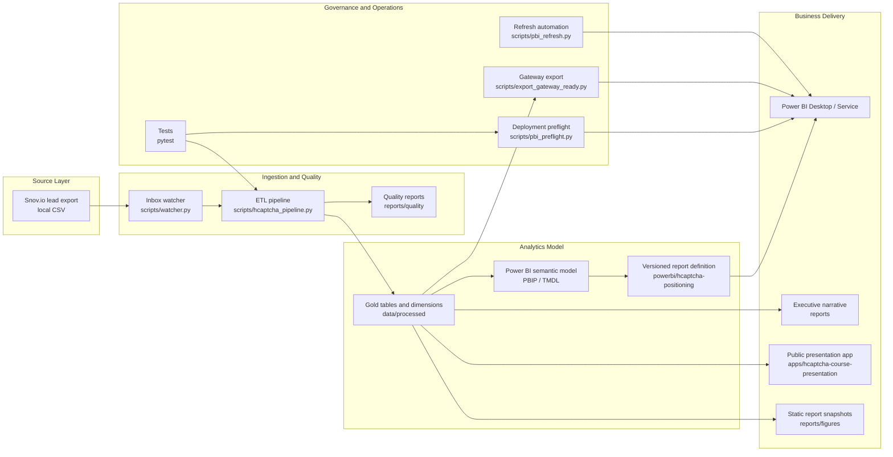

# isabellysto-prepara-portugal

## Project Overview

This repository contains a complete analytics engineering workflow for the hCaptcha Europe positioning challenge. The project starts from a lead export sourced from Snov.io and turns it into a reproducible market-intelligence asset with:

- a tested Python ETL pipeline
- a versionable Power BI Project (`PBIP`/`TMDL`)
- an executive report with GTM recommendations
- a public interactive presentation, a private presenter script, and a separate technical glossary PDF
- operational extensions for automated ingestion, quality controls, and Power BI Service deployment readiness

The core business question is: **how should hCaptcha position itself in the European market?**

## Relatório Analítico

Este README segue a mesma lógica de entrega de um repositório profissional de desafio de dados: documenta a base raw, as regras de tratamento, os controles de qualidade, os outputs do dashboard e a interpretação de negócio em uma página visível no GitHub.

### Descrição do Dataset

A análise parte da planilha original do desafio, mantida localmente como [`Planilha - Desafio de Dados - Página1.csv`](Planilha%20-%20Desafio%20de%20Dados%20-%20P%C3%A1gina1.csv) e espelhada em `data/raw/` para garantir reprodutibilidade.

| Camada | Linhas | Colunas / Escopo | Observações |
| --- | ---: | --- | --- |
| Planilha raw | 1.027 | 24 colunas originais | Atributos profissionais e empresariais da exportação de leads. |
| Base gold | 882 | 27 colunas harmonizadas | Dados deduplicados, normalizados e filtrados para empresas europeias. |
| Empresas no escopo | 748 | Empresas únicas | Base para leitura de contas e priorização de ABM. |
| Dimensão de país | 13 países | Ranking de mercado e tiers | Usada pelo Power BI e pelo snapshot público da apresentação. |

O arquivo raw contém campos pessoais e empresariais como e-mail, status do e-mail, nome do contato, cargo, país do contato, nome da empresa, porte da empresa, país da empresa, cidade da empresa, setor da empresa e classificação. A análise pública evita expor dados pessoais nos artefatos de apresentação; o Power BI e o site usam agregações, dimensões e snapshots sanitizados.

### Tratamento e Harmonização

O pipeline em [`scripts/hcaptcha_pipeline.py`](scripts/hcaptcha_pipeline.py) aplica as mesmas regras usadas pelo notebook, pelo modelo Power BI e pela apresentação pública:

| Etapa | O que acontece | Motivo analítico |
| --- | --- | --- |
| Padronização de colunas | As colunas originais em português são mapeadas para nomes analíticos estáveis. | Mantém Power BI, notebook e scripts usando o mesmo schema. |
| Deduplicação | Mantém a melhor linha por `E-mail + Nome da empresa`, priorizando status do e-mail e completude. | Evita dupla contagem do mesmo par contato/empresa. |
| Normalização geográfica | Usa `País da empresa` como lente de mercado e preserva `País` como geografia do contato. | O país da empresa é a referência correta para posicionamento comercial. |
| Filtro europeu | Mantém empresas cujo país normalizado é europeu. | Alinha a análise ao desafio de posicionamento na Europa. |
| Agrupamento de cargos | Mapeia cargos raw para categorias como `Executive / Technical Decision Maker` e `Data / Compliance`. | Transforma cargos ruidosos em personas de compra. |
| Buckets de porte | `Startup / SMB` até 50, `Mid-Market` até 250, `Enterprise` acima de 250, além de `Unknown`. | Torna o porte comparável mesmo com faixas raw inconsistentes. |
| Status do e-mail | Preserva o status original e marca `is_email_valid` quando o status é `valid`. | A análise não remove `unknown` ou `not valid`; o status permanece como atributo de qualidade. |

### Qualidade e Linhagem

O último quality gate está aprovado e registra a linhagem atual da planilha raw até os outputs Gold:

| Métrica | Valor | Interpretação |
| --- | ---: | --- |
| Linhas raw | 1.027 | Ponto de partida da planilha original do desafio. |
| Linhas Gold | 882 | Linhas após deduplicação e filtro por empresa europeia. |
| Linhas removidas | 145 | Redução de 14,1% da base raw para a Gold. |
| Linhas duplicadas por contato/empresa no raw | 203 | Warning de qualidade monitorado pelo pipeline. |
| Linhas exatamente duplicadas no raw | 2 | Registros totalmente duplicados na planilha original. |
| Linhas sem país europeu da empresa | 33 | Registros fora da lente de mercado europeia. |
| Contatos cross-border | 89 | País do contato diferente do país da empresa. |
| Taxa cross-border | 10,1% | Proxy de operação distribuída ou internacional. |
| Status do e-mail na Gold | 456 valid / 243 unknown / 183 not valid | Contexto de qualidade preservado, não filtro rígido da análise. |

O mirror do gateway Power BI em `C:\Users\02luc\Documents\PowerBIData\hcaptcha\processed` contém os mesmos quatro CSVs processados de `data/processed/`, verificados por hash durante a auditoria.

### Principais Achados Estratégicos

| Achado | Evidência | Implicação |
| --- | --- | --- |
| Concentração geográfica alta | Germany, United Kingdom, France, Spain e Portugal concentram 88,4% dos leads Gold. | Começar com GTM focado em Tier 1, sem dispersar a entrada europeia. |
| Personas de compra claras | Executive / Technical Decision Maker representa 41,3%; Data / Compliance representa 36,7%. | A mensagem precisa de uma trilha técnica e outra de privacidade/compliance. |
| Enterprise é o maior segmento | Enterprise representa 42,7%; Mid-Market 27,6%; Startup / SMB 29,1%. | Provar valor em contas maiores e depois escalar para mid-market e SMB. |
| Comportamento é inferido | A fonte não possui cliques, stack, visitas ou eventos de intenção. | Usar proxies firmográficos e declarar essa limitação com clareza. |

## Architecture



## Dashboard e Snapshots

As imagens abaixo deixam os principais outputs analíticos visíveis diretamente no GitHub. O relatório interativo completo continua versionado como Power BI Project em [`powerbi/hcaptcha-positioning/hcaptcha_report.pbip`](powerbi/hcaptcha-positioning/hcaptcha_report.pbip), enquanto as figuras estáticas ficam em [`reports/figures/`](reports/figures/).

### Prioridade de Mercado por País


### Mix de Personas por Porte de Empresa


### Sinal Cross-Border


## Repository Structure

- `scripts/`: ETL pipeline, Power BI project generation, and operational automation
- `tests/`: pytest coverage for transformation rules and operational scripts
- `notebooks/`: exploratory and delivery notebook assets
- `powerbi/`: versionable Power BI Project (`PBIP`/`TMDL`)
- `apps/`: presentation apps and web delivery surfaces
- `reports/`: executive report plus generated figures and ops logs
- `docs/`: Power BI blueprints, semantic-model notes, design specs, plans, and deployment runbooks
- `data/`: local-only raw and processed data directories kept out of Git by design

## Governance and Privacy

Real lead exports are intentionally excluded from version control. Raw and processed datasets may contain personally identifiable information such as names, emails, and company details. For that reason:

- `data/raw/` and `data/processed/` are ignored by Git
- `.pbix` binaries are ignored; the repository keeps the text-based `PBIP` source instead
- local toolchains and secrets are not published

This repository is designed to be safe for public versioning while keeping the project reproducible.

## How to Run

### 1. Prepare your local data

Place the raw Snov.io export in `data/raw/inbox/` or run the pipeline directly against a local CSV path.

### 2. Install local dependencies

Example:

```bash
python -m pip install pandas pytest jupyter matplotlib seaborn plotly watchdog requests
```

Optional local tooling used during development:

- Power BI Desktop on Windows
- `pbi-tools`
- `.NET`

### 3. Run the ETL pipeline

```bash
python scripts/hcaptcha_pipeline.py \
  --input /path/to/export.csv \
  --output-dir data/processed \
  --quality-dir reports/quality \
  --config config/pipeline_settings.json
```

### 4. Process the inbox automatically

One-shot mode:

```bash
python scripts/watcher.py --once --config config/pipeline_settings.json
```

Continuous watch mode:

```bash
python scripts/watcher.py --config config/pipeline_settings.json
```

### 5. Open the Power BI Project

Open `powerbi/hcaptcha-positioning/hcaptcha_report.pbip` in Power BI Desktop, refresh the model, and save a local `.pbix` if needed.

### 6. Regenerate the presentation snapshot and PDF

```bash
python scripts/build_presentation_snapshot.py
npm --prefix apps/hcaptcha-course-presentation run deck
```

Run the local presentation site:

```bash
npm --prefix apps/hcaptcha-course-presentation run dev -- --port 5174
```

### 7. Prepare the Power BI Service deployment kit

Validate local prerequisites:

```bash
python scripts/pbi_preflight.py --config config/pipeline_settings.json
```

Mirror approved outputs to the Windows gateway path:

```bash
python scripts/export_gateway_ready.py --config config/pipeline_settings.json
```

Preview the Power BI refresh request:

```bash
python scripts/pbi_refresh.py --dry-run
```

## Power BI Service Readiness

The repository includes a deploy-ready path for Power BI Service:

- approved Gold outputs are mirrored to a fixed Windows folder for gateway use
- a deployment preflight validates required settings
- a refresh script can trigger a dataset refresh through the Power BI REST API

See:

- `docs/deploy_pbi_service.md`
- `docs/operational_runbook.md`

## Technical Stack

- Python 3
- pandas
- pytest
- Jupyter
- Power BI PBIP / TMDL
- Power BI REST API

## Current Status

The repository currently contains:

- the original hCaptcha market analysis implementation
- the PBIP project used to materialize the dashboard in Power BI Desktop
- the `apps/hcaptcha-course-presentation` interactive presentation backed by a sanitized Level 2 JSON snapshot
- public PDF deck, private presenter script, and technical glossary artifacts generated from the same data source
- operational design scaffolding for automated ingestion, quality gates, and Service refresh

## Notes

If you clone this repository, keep your own local data files under `data/` and your own credentials in environment variables or local `.env` files that are not committed.
