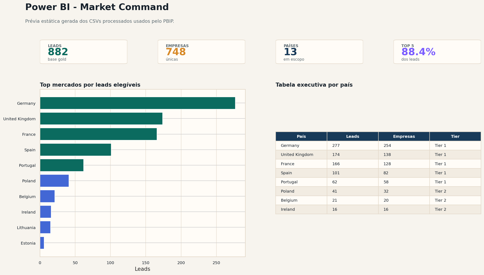
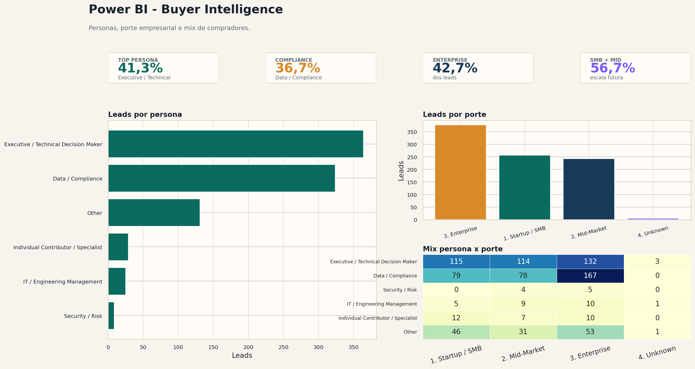
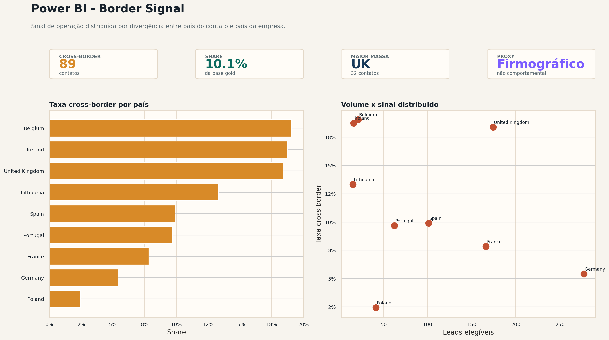
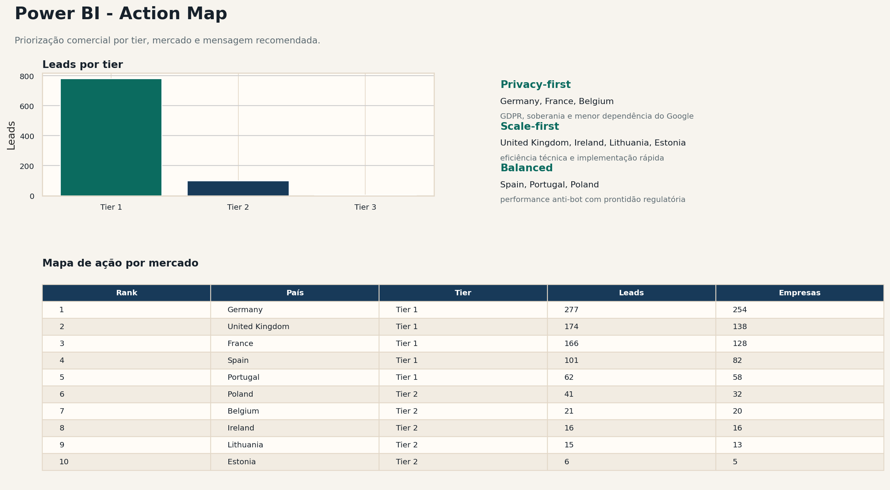
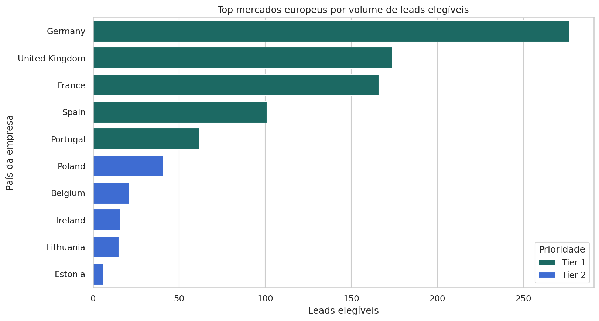
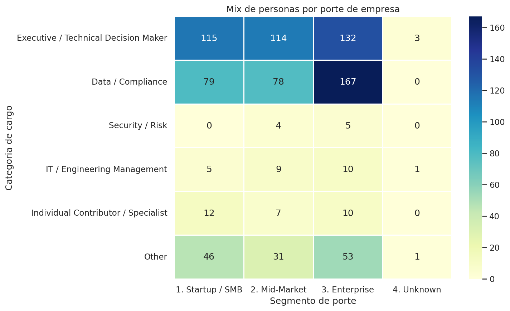
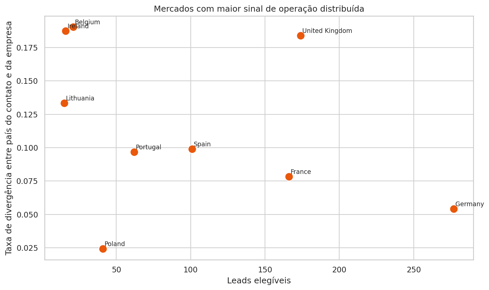

# hCaptcha Power BI Project

Este projeto foi estruturado em formato `PBIP` para desenvolvimento versionável.

## Como abrir

1. Abra [hcaptcha_report.pbip](hcaptcha_report.pbip) no Power BI Desktop.
2. Verifique o parâmetro `DataRoot` no Semantic Model.
3. Faça o refresh do modelo.
4. Se quiser o artefato monolítico, use `Save As` no Desktop para gerar um `.pbix`.

## Pré-visualização do relatório Power BI

As imagens abaixo deixam as páginas do relatório visíveis diretamente no GitHub. Elas são geradas em `reports/figures/` a partir dos mesmos CSVs processados usados pelo projeto `PBIP`; a exploração interativa continua no Power BI Desktop gratuito.

### Market Command

### Buyer Intelligence

### Border Signal

### Action Map

## Figuras analíticas complementares

### Prioridade de mercado por país

### Mix de personas por porte

### Sinal de operação distribuída

## Observações

- O modelo lê os CSVs processados pelo parâmetro `DataRoot`, apontando para `C:\Users\02luc\Documents\PowerBIData\hcaptcha\processed`.
- Esse diretório Windows funciona como espelho local dos arquivos de `data/processed/`.
- O relatório usa visuais nativos do Power BI para cards, barras, tabelas e filtros interativos.
- O dataset já inclui medidas para leads, empresas, países, cross-border share e segmentação por persona e porte.
